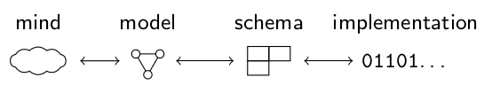

# Daten

## Was ist das?

{height=90%}

::: notes

Was ist das? (Bitte Vorschläge in einem Wort)

:::

## Was ist das?

:::columns
::::column
{height=80%}
:::
::::column

Bitte raten unter [menti.com](https://www.menti.com/)

Code 5234 8088

oder <https://www.menti.com/k5zd3cbuzh>
::::
:::

## Was ist das?

:::columns
::::column
{height=80%}
:::
::::column
* Eine Antilope

* Eine Addax-Antilope

* Eine Abbildung einer Addax-Antilope

* Ein Digitalisat einer (älteren) Abbildung einer Addax-Antilope

* Eine Bilddatei

* ...

*Interpretation erfordert Hintergrundwissen*

::::
:::

::: notes

Beispielsweise ist für das geübte Auge sichtbar, das es sich um ein Digitalisat aus einem älteren Buch handelt.

:::

## Verschiedene Sichten auf Daten

* Daten als Fakten ("So sieht eine Addax aus")

* Daten als Beobachtungen ("Abbildung einer Addax")

* Daten als **Dokumente** ("Bilddatei")

::: notes

Für das Verständnis von Datenformaten interessiert uns primär die Sichtweise von Daten als Dokumenten. Nicht was ist abgebildet, sondern wie ist es gespeichert.

:::

## Daten-Dokumente entschlüsseln

* Was steht in den Daten (Inhalt: Semantik)

    * Antilope, Abbildung...

* Wo kommt das Dokument her? (Kontext: Pragmatik)

    * Identifier, Schnittstellen, Verarbeitung...

* Wie sind Daten strukturiert? (Struktur: Syntax)

    * JPEG-Datei, 790x878 Pixel...

\vfill
*Entschlüsselung erfordert Wissen über Datenformate*

::: notes

Ebenso wie das inhaltliche Entschlüsseln Kontextwissen über Antilopen und Bücher erfordert, ist zur Analyse von Daten Kontextwissen über Datenformate notwendig.

:::

## Welche Datenformate kennen Sie?

Nächste Frage unter [menti.com](https://www.menti.com/)

Code 5234 8088

oder <https://www.menti.com/k5zd3cbuzh>

# Einordnung von Datenformaten

## Grobe Übersicht nach Anwendung (1/2)

* Dokumentformate:\
  HTML, TEI, Office, Markdown, Bild- & Audio-Formate...

* (bibliographische) **Metadatenformate**:\
  MARC, MODS, LIDO, EAD, PICA...

## Grobe Übersicht nach Anwendung (2/2)

* **Strukturierungssprachen**:\
  CSV, JSON, RDF...

* **Schemasprachen**:\
  Reguläre Ausdrücke, XSD, JSON Schema...

* **Abfragesprachen**:\
  SQL, XPath, XQuery, CSS Selector...

* Datenmodelle:\
  BIBFRAME, CIDOC-CRM, Dublin Core...

## Datenmodelle

* Hinter Daten steht immer (implizit oder explizit) mindestens ein Modell

* Datenformate bewegen sich zwischen Modell und Implementierung

## Eine "Grammatik" der Datenformate

::: columns
:::: column

* Lehre vom Bau einer Sprache, ihren Formen, Gesetzmäßigkeiten und Funktionen im Satz

* Elemente wie Wortarten, Satzbau, Regeln...

* Verschiedene Sprachen und Dialekte

* Unabhängig von der Bedeutung

::::
:::: column

::::
:::

# Datenstrukturierungssprachen

## Ein Datensatz (ohne Datenformat)

Name                Lebensdaten
------------------- -------------
Douglas Noël Adams  1952-2001

*Erkennen Sie Modell und Schema?*

## Ein Datensatz (CSV)

~~~csv
name,dates
Douglas Noël Adams,1952-2001
~~~

## Ein Datensatz (YAML)

~~~yaml
name: Douglas Noël Adams
dates: 1952-2001
~~~

## Ein Datensatz (JSON)

~~~json
{
  "name": "Douglas Noël Adams",
  "dates": "1952-2001"
}
~~~

## Ein Datensatz (XML)

~~~xml
<name>Douglas Noël Adams</name>
<dates>1952-2001</dates>
~~~

## Datenstrukturierungssprachen

* JSON, YAML, CSV, XML, RDF...

* Allgemeine Struktur in der sich fast alles ausdrücken lässt

* Je nach Sprache einiges besser als anderes

* Vergleich: Deutsch, Englisch, Spanisch, Japanisch...

* Konkrete Datenformate sind eher "Fachsprachen"

# Praxisbeispiel

## Ein JSON-Datensatz

~~~json
{
  "name": "Douglas Noël Adams",
  "dates": "1952-2001"
}
~~~

## Ein JSON-Datensatz

~~~json
{
  "xxxx": "xxxxxxxxxxxxxxxxxx",
  "xxxxx": "xxxxxxxxx"
}
~~~

## Anatomie eines JSON-Datensatz

Syntax      Struktur
----------- --------------------------
`"..."`     Unicode-Zeichenketten
`{...}`     Key-Value-Paare ("Object")

*JSON hat noch mehr, ist aber überschaubar!*

## Praxis mit dem JSON Editor

<https://jsoneditoronline.org/beta/>

~~~json
{
  "name": "Douglas Noël Adams",
  "dates": "1952-2001"
}
~~~

Aufgabe in Kleingruppen á 5 Personen

1. Video an Ton an, bitte laut gemeinsam denken!
2. Datensatz eingeben
3. Weitere Daten hinzufügen (z.B. Alter, Identifier...)
4. Feedback: Menti Code 4936 6360 oder <https://www.menti.com/5r2gnu61md>

## Feedback

...

## Lessons Learned

* Passende Daten-Editoren helfen ungemein

* Ohne Syntax-Highlighting ist das Leben trist und grau

    * Weitere Werkzeuge: Code-Formatierung, Linter

* Manche Syntax-Elemente sind irrelevant

* Syntax-Elemente sind nicht der Inhalt...

* ...sondern Gerüst für eine Datenstruktur (z.B. JSON)

## Wo ist der Inhalt?

~~~json
{
  "xxxx": "xxxxxxxxxxxxxxxxxx",
  "xxxxx": "xxxxxxxxx"
}
~~~

## Wo ist der Inhalt?

~~~json
{
  "xxxx": "xxxxxxxxxxxxxxxxxx",
  "xxxxx": "xxxxxxxxx"
}
~~~

\hfill

* `xxx..`: Unicode-Zeichenketten

* Unicode ist auch nur ein Datenformat mit Modell, Schema und Implementierungen

* Daten haben keinen Inhalt

## Es kommt auf die Betrachtungsebene an

Zeichenkette \rightarrow JSON-Struktur \rightarrow konkretes JSON-Format \rightarrow ... \rightarrow Bedeutung

~~~json
{
  "xxxx": "xxxxxxxxxxxxxxxxxx",
  "xxxxx": "xxxxxxxxx"
}
~~~

~~~json
{
  "name": "Xxxxxxx Xxxx Xxxxx",
  "dates": "0000-0000"
}
~~~

Datenformat: Menge von Daten mit einigen Beschränkungen und Freiheitsgraden

# Daten-Schemas

## Was ist ein Schema?

* Beschränkungen und Freiheitsgrade über einer Datenstrukturierungssprache

* Beispiel: JSON-Dokument mit notwendigen und optionalen Feldern

* Oft gibt es keine *expliziten* Schemas sondern 

    * (Best-?)Practice
    * Standards
    * Anwendungen
    * ...

* Besser: formale Schemas in einer Schemasprache

## Beispiel: JSON-Schema

~~~json
{
  "$schema": "http://json-schema.org/draft-07/schema#", 
  "type": "object",
  "properties": {
    "name":  { "type": "string" },
    "dates": { "type": "string" }
  }
}
~~~

## Beispiel: JSON-Schema

~~~json
{
  "$schema": "http://json-schema.org/draft-07/schema#", 
  "type": "object",
  "properties": {
    "name":  { "type": "string" },
    "dates": {
      "type": "string",
      "pattern": "^[0-9]{4}(-[0-9]{4})?$",
    }
  }
}
~~~

Reguläre Ausdrücke: Schemas für Zeichenketten

# Zusammenfassung

## Daten entschlüsseln

* Verschiedene Sichten auf Daten sind möglich und relevant
    * Fakten vs. Beobachtungen vs. Dokumente
    * Inhalt vs. Struktur vs. Kontext
    * Kodierungsebenen
* Erfahrung im Umgang mit Datenformaten (Data Literacy)

## Grammatik der Datenformate

...

## Allgemeine Datenwerkzeuge

* **Erstellung:** Editoren
* **Validierung:** Validatoren (Syntax- & Schema-Ebene)
* **Abfrage:** ...

## Mehr zu Datenformaten...

Übung macht die Meister:in!

<https://format.gbv.de>

# Anhang

## Wo kommt die Antilope her?

::: columns
:::: column
{height=80%}
::::
:::: column
Bertuch & Bertuch (1824): Bilderbuch für Kinder, Band 11, Seite 195
::::
:::

## Wo kommt die Antilope her?

Antilope per IIIF

<https://digi.ub.uni-heidelberg.de/diglit/iiif/bertuch1824bd11/manifest.json>

<https://digi.ub.uni-heidelberg.de/iiif/2/bertuch1824bd11%3A195.jpg/1150,1450,790,850/790,/0/default.jpg>
